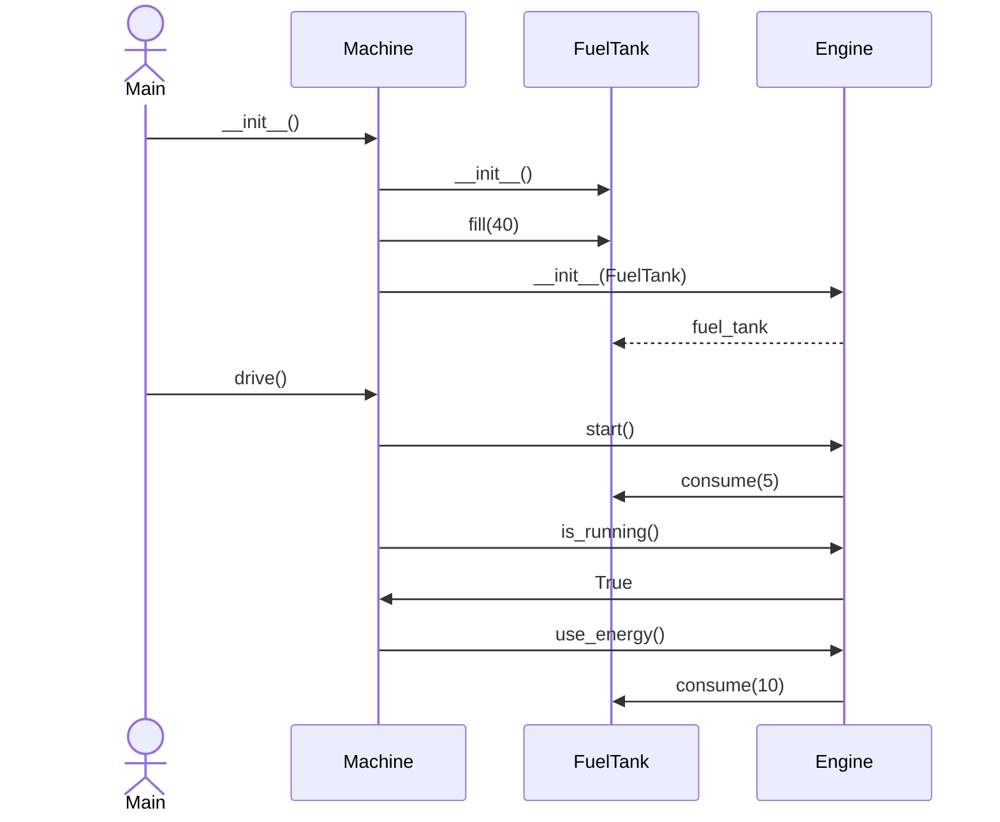

```mermaid
sequenceDiagram
	actor Main
	participant Machine
	participant FuelTank
	participant Engine
	Main->>Machine: __init__()
	Machine->>FuelTank: __init__()
	Machine->>FuelTank: fill(40)
	Machine->>Engine: __init__(FuelTank)
	Engine-->>FuelTank: fuel_tank
	Main->>Machine: drive()
	Machine->>Engine: start()
	Engine->>FuelTank: consume(5)
	Machine->>Engine: is_running()
	Engine->>Machine: True
	Machine->>Engine: use_energy()
	Engine->>FuelTank: consume(10)
	
```
